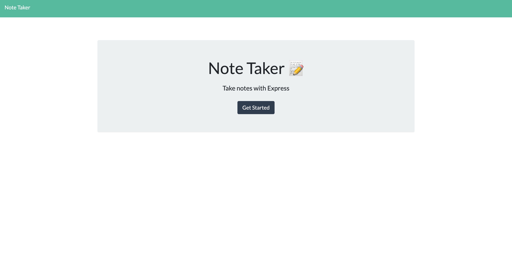
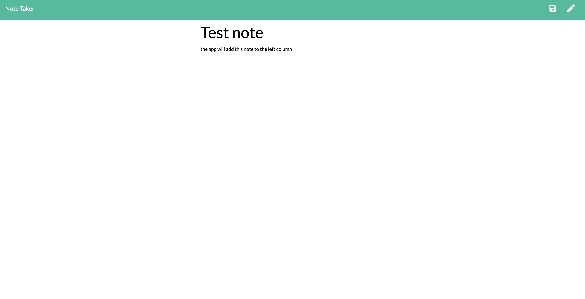
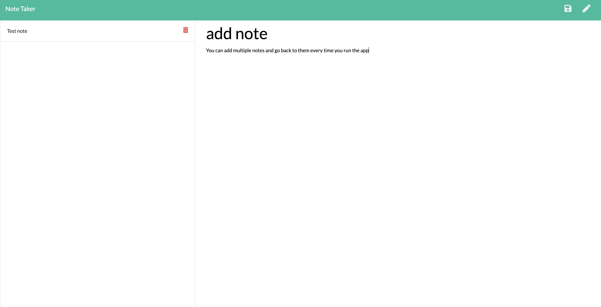
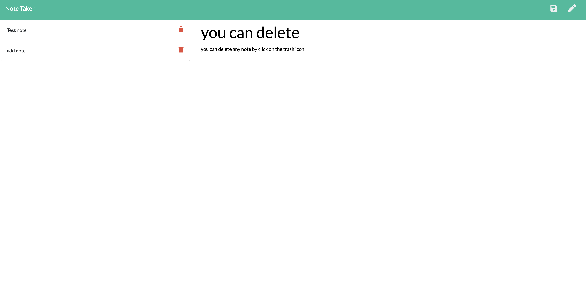
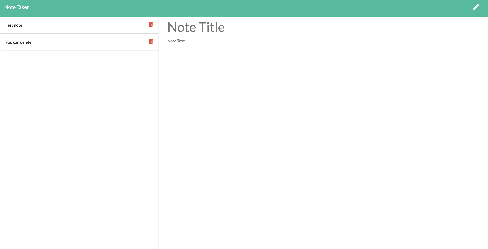

# note-taker

## Description

An interactive website where you can write, save and delete notes. Acting like a virtual notepad, this note-taker can be operated without download by reviewing it in heroku application online.

## How to use  the app

A note-taking application
When you open the Note Taker then you will presented with a landing page with a link to a notes page, when you click on the link to the notes page
you will  presented with a page with existing notes listed in the left-hand column, plus empty fields to enter a new note title and the note’s text in the right-hand column.
When you enter a new note title and the note’s text then a Save icon appears in the navigation at the top of the page, When you click on the Save icon
then the new note you have entered is saved and appears in the left-hand column with the other existing notes.
When you click on an existing note in the list in the left-hand column ,then that note appears in the right-hand column.
When you click on the Write icon in the navigation at the top of the page
then you will presented with empty fields to enter a new note title and the note’s text in the right-hand column.

## Installation

```${blackBlink.name}
npm i
```

## languages

```${blackBlink.name}
JAvaScript,ES6,node.js,Express.js
```

## Links

```${blackBlink.name}
Heroku link : https://murmuring-spire-94172.herokuapp.com/
gitHub link : https://github.com/MahmoudAbdulrhman/note-taker
```

## ScreenShots












Thank you
